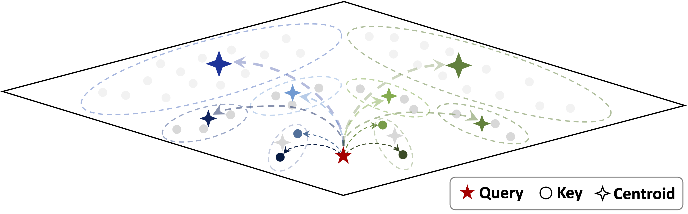

# Multipole Attention for Efficient Long Context Reasoning



**Multipole Attention is an approach to accelerate long-context reasoning applications.**

Reasoning models have shown promising accuracy gains for complex problem-solving tasks; however, these models need to generate long chain-of-thought reasoning in order to think before answering, which requires generating thousands of tokens. While sparse attention methods can help reduce the KV cache pressure induced by this long autoregressive reasoning, these methods can introduce errors which disrupt the reasoning process. Additionally, prior methods often pre-processed the input to make it easier to identify the important prompt tokens when computing attention during generation, and this pre-processing is challenging to perform online for newly generated reasoning tokens.

Multipole Attention addresses these challenges and accelerates autoregressive reasoning by **only computing exact attention for the most important tokens, while maintaining approximate representations for the remaining tokens**. Our method first performs clustering to group together semantically similar key vectors, and then uses the cluster centroids both to identify important key vectors and to approximate the remaining key vectors in order to retain high accuracy. We also use a **fast cluster update process** to quickly re-cluster the input and previously generated tokens, thereby allowing for  accelerating attention to the previous output tokens.

[[Paper](https://arxiv.org/abs/2506.13059)]

## Installation

1. Create a conda environment
```
conda create --name multipoleattention python=3.9 -y
conda activate multipoleattention
```

2. Clone and install the dependencies (including the local transformers environment)
```
pip install torch torchvision torchaudio
cd transformers
pip install -e .
cd ..
pip install -e .
```

3. Install additional dependencies
Install flash attention from https://github.com/Dao-AILab/flash-attention

```
pip install flash-attn==2.5.4 --no-build-isolation
```

---

4. Install gsm-infinite dependencies

Follow the installation instructions in the gsm_infinite directory before running gsm-infinite evaluation.

---


## Evaluation

`LongBench/run_centroid.sh` provides an example of how to run LongBenchV2 evaluation.

`gsm_infinite/gsm-infinite/run_centroid_hybrid.sh` provides an example of how to run GSM-infinite evaluation. Note that the script will generate output predictions, but `vllm_serve.sh` must also be used to launch a model for parsing outputs in order to collect the final output results, and the `run_evaluation` argument in `config.sh` must be set to True to run evaluation.

---

## Kernel Implementation

`benchmark/benchmark_kernels.py` is a benchmarking script for the centroid lookup, centroid replacement, and sparse flash decoding kernels.

`benchmark/benchmark_kmeans.py` is a benchmarking script for the online clustering update.


---

## Citation

Multipole Attention has been developed as part of the following paper. We appreciate it if you would please cite the following paper if you found the library useful for your work:

```
@article{hooper2025multipole,
  title={Multipole Attention for Efficient Long Context Reasoning},
  author={Hooper, Coleman and Zhao, Sebastian and Manolache, Luca and Kim, Sehoon and Mahoney, Michael W and Shao, Yakun Sophia and Keutzer, Kurt and Gholami, Amir},
  journal={arXiv preprint arXiv:2506.13059},
  year={2025}
}
```

---

## Acknowledgement

This code reuses components from existing libraries including [Squeezed Attention](https://github.com/SqueezeAILab/SqueezedAttention), [LongBench](https://github.com/THUDM/LongBench), and [GSM-Infinite](https://github.com/infini-ai-lab/gsm_infinite).

The Triton kernel implementations in this repository are built on top of the [FlashAttention2 Triton Tutorial](https://triton-lang.org/main/getting-started/tutorials/06-fused-attention.html) as well as prior work on [Sparse FlashAttention kernels](https://arxiv.org/abs/2306.01160).
